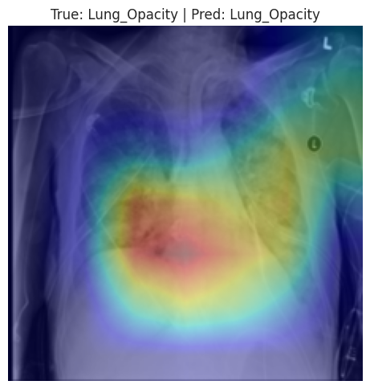
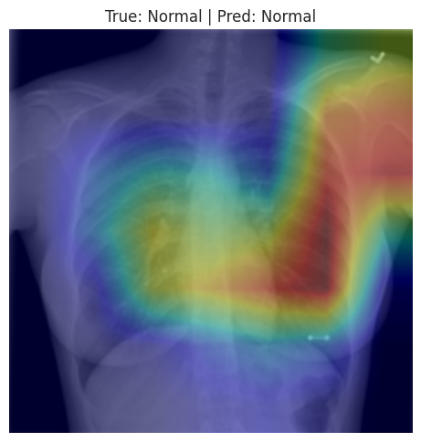
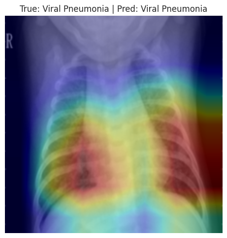
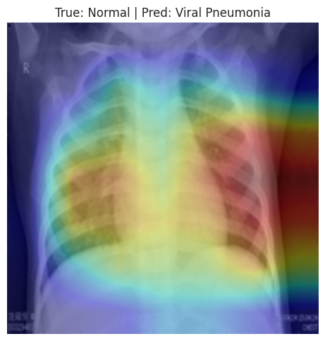

# AI for Medicine - Project Report

## 1. Project Title

Automated Chest X-ray Classification.

## 2. Problem Statement

Healthcare systems generate large and continuously increasing volumes of medical images, including chest X-rays. The interpretation of these images requires specialized radiological expertise, clinical context, and careful visual assessment. This creates a substantial workload for clinicians and can increase reporting time, particularly when large image collections must be reviewed or when rapid triage is required.

In this project, the problem is formulated as a supervised medical image classification task involving four chest X-ray categories: COVID-19, Lung Opacity, Normal, and Viral Pneumonia.

## 3. Objective of the Study

The objective of this study is to develop and evaluate a reproducible deep learning pipeline for automated chest X-ray image classification using the COVID-19 Radiography Database. The project focuses on distinguishing four radiographic categories: COVID-19, Lung Opacity, Normal, and Viral Pneumonia.

To support a reliable evaluation, the study follows a structured workflow including data quality assessment, duplicate removal, data leakage prevention, stratified data splitting, model comparison, final test evaluation, and Grad-CAM explainability.

## 4. Dataset Description

This study uses the COVID-19 Radiography Database, a publicly available chest X-ray dataset from Kaggle. The dataset was downloaded directly in the notebook using KaggleHub to improve reproducibility.

After loading the images and removing exact duplicates, the cleaned dataset contained 21,111 chest X-ray images. The dataset is imbalanced, with Normal being the largest class and Viral Pneumonia the smallest. This imbalance should be considered when interpreting the class-level results.

**Figure 1.** Class distribution after exact duplicate removal.

## 5. Data Preprocessing

Image file paths and class labels were collected into a dataframe with three main fields: filepath, label, and label_encoded. Exact duplicate images were detected using file hashes and removed before any train-test split was created. The number of images decreased from 21,165 to 21,111 after duplicate removal.

No data harmonization method was applied, because the available metadata did not provide acquisition site or scanner information. All images were resized to 224 x 224 pixels, converted to three-channel RGB format, and normalized using ImageNet normalization. Basic data augmentation, including random horizontal flipping and small rotation, was applied only to the training data.

## 6. Avoiding Data Leakage

To reduce the risk of data leakage, exact duplicates were removed before splitting the dataset. The cleaned dataset was then divided using a stratified 80/20 train-test split, producing 16,888 training/development images and 4,223 independent test images.

The test set was kept untouched during model selection, hyperparameter tuning, and cross-validation. Stratified 5-fold cross-validation was performed only on the training/development set. A hash overlap check between the training and test sets returned zero overlap.

## 7. Machine Learning Pipeline

The project compared two deep learning models. The first model was a custom convolutional neural network trained from scratch and used as a baseline. The second model was MobileNetV2 pretrained on ImageNet and adapted for four-class classification through transfer learning.

The custom CNN contained 93,764 parameters, while MobileNetV2 contained 2,228,996 parameters after replacing the classifier head for four output classes. CrossEntropyLoss and AdamW optimization were used for training. Early stopping was applied to reduce unnecessary training when validation performance stopped improving.

Model selection was performed with stratified 5-fold cross-validation on the training/development set. Hyperparameter tuning was intentionally small and practical for Google Colab: the CNN baseline used a fixed configuration, while MobileNetV2 was tested with two learning rates and a fixed weight decay. The independent test set was not used during tuning.

## 8. Results

Stratified 5-fold cross-validation showed that MobileNetV2 clearly outperformed the custom CNN baseline. The CNN achieved a mean validation accuracy of 65.83%, while MobileNetV2 achieved the best mean validation accuracy of 94.72% using a learning rate of 0.0003 and weight decay of 0.0001.

| Model | Learning rate | Weight decay | Mean CV accuracy | Standard deviation |
|---|---:|---:|---:|---:|
| CNN | 0.0010 | 0.0001 | 0.6583 | 0.0096 |
| MobileNetV2 | 0.0010 | 0.0001 | 0.9334 | 0.0106 |
| MobileNetV2 | 0.0003 | 0.0001 | 0.9472 | 0.0057 |

Based on cross-validation performance, MobileNetV2 with learning rate 0.0003 and weight decay 0.0001 was selected as the final model. After retraining on the full training/development set, it was evaluated once on the untouched independent test set.

| Metric | Value |
|---|---:|
| Test accuracy | 0.9436 |
| Test loss | 0.1649 |
| Macro F1-score | 0.9539 |
| Weighted F1-score | 0.9431 |
| Macro AUC | 0.9938 |

Class-level performance was strongest for COVID-19 and Viral Pneumonia. Lung Opacity had the lowest recall, indicating that this class was the most difficult for the model to identify.

| Class | Precision | Recall | F1-score | Support |
|---|---:|---:|---:|---:|
| COVID | 0.9901 | 0.9790 | 0.9845 | 714 |
| Lung Opacity | 0.9672 | 0.8570 | 0.9088 | 1203 |
| Normal | 0.9149 | 0.9755 | 0.9442 | 2038 |
| Viral Pneumonia | 0.9604 | 0.9963 | 0.9780 | 268 |

**Figure 2.** Test confusion matrix for the selected MobileNetV2 model. Most errors occurred when Lung Opacity images were predicted as Normal.

**Figure 3.** One-vs-rest ROC curves on the independent test set. All classes achieved high AUC values, with macro AUC equal to 0.9938.

Grad-CAM was also generated for qualitative explainability. The notebook produced one correctly classified example for each class and two misclassified examples. These visualizations are useful for inspecting model attention, but they should not be interpreted as clinical explanations.

**Figure 4.** Grad-CAM examples for correct and incorrect predictions. The misclassified Lung Opacity case supports the quantitative result that Lung Opacity was the most challenging class.

## 9. Discussion

The results show a clear advantage of transfer learning over training a small CNN from scratch. The custom CNN provided a useful baseline, but its lower cross-validation accuracy suggests that it was not able to learn sufficiently strong image features from the dataset alone. In contrast, MobileNetV2 achieved much higher and more stable performance, indicating that pretrained convolutional features were effective for this chest X-ray classification task.

Although the final MobileNetV2 model achieved strong overall performance, the class-level results show that Lung Opacity was the most challenging category. This may be due to the more subtle radiographic appearance of lung opacity and its possible visual overlap with normal chest X-rays. Therefore, the results highlight the importance of evaluating class-level metrics rather than relying only on overall accuracy.

The high AUC values indicate strong class separation in the model's predicted probabilities. However, AUC alone does not guarantee clinical reliability. External validation, calibration, and expert review would be required before any medical or deployment-oriented interpretation.

## 10. Conclusions and Future Work

This project demonstrated that a reproducible PyTorch-based pipeline can be used for automated four-class chest X-ray classification. MobileNetV2 clearly outperformed the custom CNN baseline and achieved strong performance on the independent test set.

Future work should focus on improving the classification of Lung Opacity, which showed the lowest recall. Additional steps could include stronger class imbalance handling, targeted data augmentation, lung-region-based preprocessing, probability calibration, and external validation on independent chest X-ray datasets.

Future work should also address data harmonization more explicitly. In this project, harmonization was not applied because acquisition site or scanner metadata were not available. A stronger future study should collect or use datasets with site, scanner, and acquisition-protocol information, then assess whether harmonization methods reduce domain shift and improve generalization across institutions.

Since MobileNetV2 is suitable for lightweight deployment, future work should also investigate Edge AI preparation through model compression, quantization, ONNX export, and inference-time evaluation on edge devices.

## 11. Ethics and Data Privacy

This project used a publicly available chest X-ray dataset from Kaggle. No personally identifiable patient information was accessed or processed directly. The work was conducted for educational and research purposes only.

The COVID-19 Radiography Database is subject to its original Kaggle dataset terms and any associated usage restrictions. The model should not be interpreted as a clinically validated diagnostic tool. Any real medical use would require expert clinical review, bias assessment, prospective validation, and appropriate regulatory evaluation.

## 12. Code and Reproducibility

The main notebook file is `chest_xray.ipynb`, developed for Google Colab with GPU acceleration. It contains the complete workflow from Kaggle dataset download to final test evaluation and Grad-CAM visualization.

The notebook includes dataframe creation, duplicate removal, stratified splitting, cross-validation, model comparison, final model retraining, independent test evaluation, and explainability. Random seeds were set for Python, NumPy, and PyTorch. The test set was not used during model selection or hyperparameter tuning. All reported metrics and figures are produced from executed notebook outputs and were not manually modified.

## 13. References

Rahman, T. et al. Exploring the Effect of Image Enhancement Techniques on COVID-19 Detection Using Chest X-ray Images. Computers in Biology and Medicine, 2021.

Tawsifur Rahman. COVID-19 Radiography Database. Kaggle Dataset. https://www.kaggle.com/datasets/tawsifurrahman/covid19-radiography-database

Sandler, M. et al. MobileNetV2: Inverted Residuals and Linear Bottlenecks. IEEE/CVF Conference on Computer Vision and Pattern Recognition, 2018.

Paszke, A. et al. PyTorch: An Imperative Style, High-Performance Deep Learning Library. NeurIPS, 2019.

Selvaraju, R. R. et al. Grad-CAM: Visual Explanations from Deep Networks via Gradient-based Localization. IEEE International Conference on Computer Vision, 2017.

Pedregosa, F. et al. Scikit-learn: Machine Learning in Python. Journal of Machine Learning Research, 2011.
