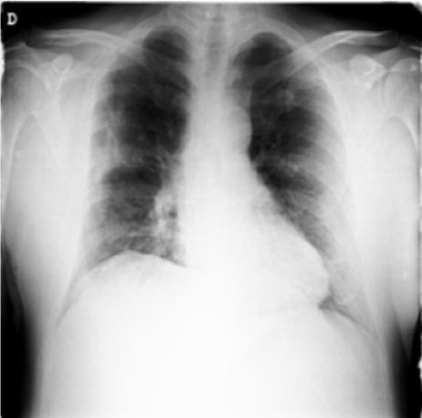
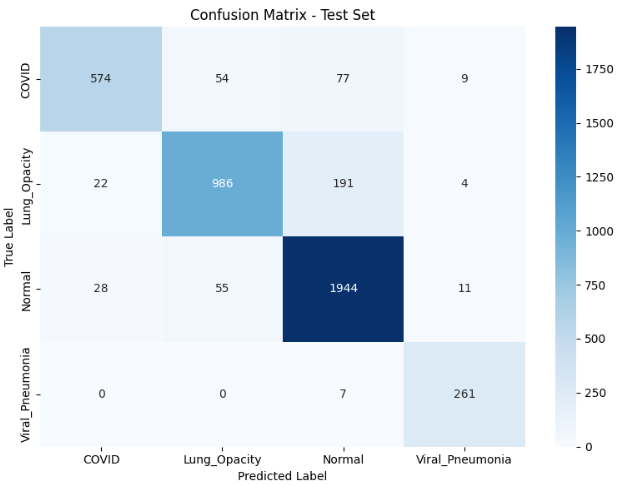
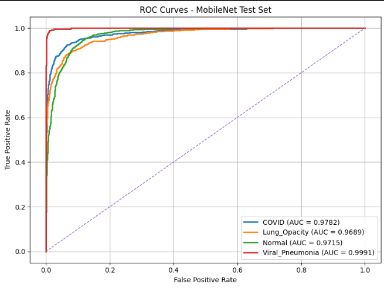

# Chest X-Ray Classification 

<p align="center">
  
</p>

<p align="center">
  Classification of COVID-19, Lung Opacity, Normal, and Viral Pneumonia Chest X-ray Images using Deep Learning
</p>

---

## Project Overview

This project investigates the use of deep learning for automatic chest X-ray classification. Two approaches were evaluated:

* Custom Convolutional Neural Network (CNN)
* MobileNet Transfer Learning

The models were trained and validated on the COVID-19 Radiography Database and evaluated using stratified 5-fold cross-validation and an independent test set.

---

## Dataset

**Source:** COVID-19 Radiography Database (Kaggle)

| Class           |     Images |
| --------------- | ---------: |
| Normal          |     10,191 |
| Lung Opacity    |      6,012 |
| COVID-19        |      3,570 |
| Viral Pneumonia |      1,338 |
| **Total**       | **21,111** |

After duplicate removal, the dataset was split into:

* Training Set: 16,888 images
* Test Set: 4,223 images

---

## Methodology

### Data Preprocessing

* Duplicate image removal
* Stratified train-test split
* Image resizing (224×224)
* RGB conversion
* Pixel normalization
* Label encoding

### Models

| Model     | Description                                         |
| --------- | --------------------------------------------------- |
| CNN       | Custom baseline architecture                        |
| MobileNet | Transfer learning using ImageNet pretrained weights |

---

## Results

### Cross-Validation Performance

| Model     | Mean Accuracy |
| --------- | ------------: |
| CNN       |        67.65% |
| MobileNet |        87.96% |

### Final Test Performance (MobileNet)

| Metric    |  Value |
| --------- | -----: |
| Accuracy  | 89.15% |
| Macro AUC | 0.9795 |

---

## Confusion Matrix

<p align="center">
  
</p>

---

## ROC Curves

<p align="center">
  
</p>

### AUC Scores

| Class           |    AUC |
| --------------- | -----: |
| COVID-19        | 0.9782 |
| Lung Opacity    | 0.9689 |
| Normal          | 0.9715 |
| Viral Pneumonia | 0.9991 |

---

## Technologies

* Python
* TensorFlow / Keras
* Scikit-Learn
* NumPy
* Pandas
* Matplotlib
* Seaborn
* Google Colab

---

## Repository Structure

```text
.
├── notebook/
│   └── chest_xray_classification.ipynb
├── figures/
│   ├── sample_xray.png
│   ├── confusion_matrix.png
│   └── roc_curve.png
├── README.md
└── requirements.txt
```

---

## Author

Reza Farjadnia

Master's Degree in Electronics Engineering

University of Bologna
