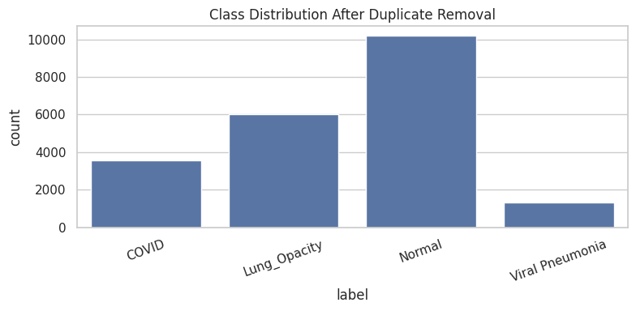
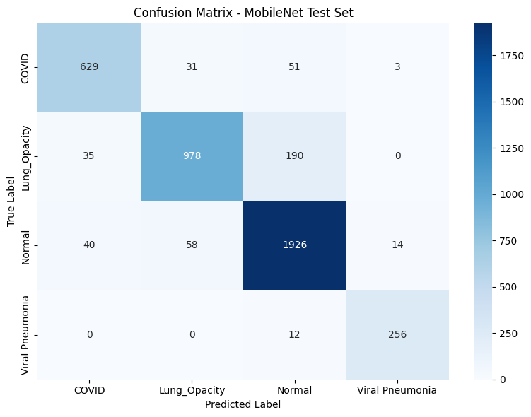
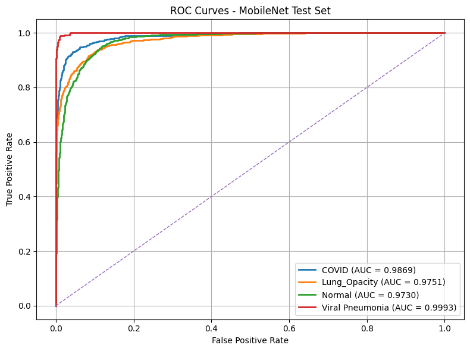
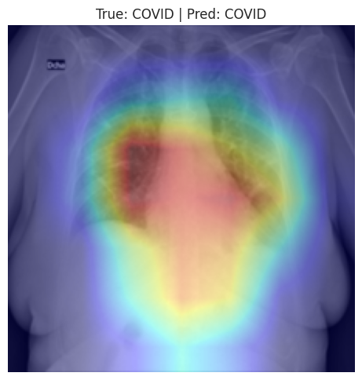
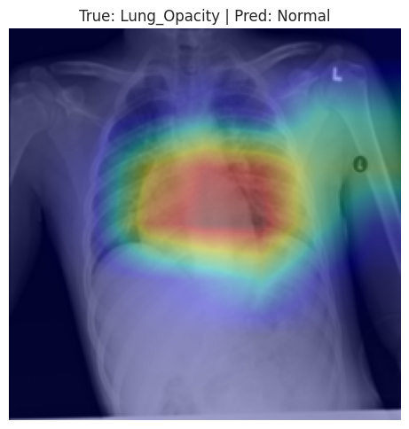

# Automated Chest X-ray Classification

  
## Project Overview

This repository contains a reproducible deep learning pipeline for classifying chest X-ray images into four categories:

- COVID
- Lung_Opacity
- Normal
- Viral Pneumonia

The project compares a small custom CNN baseline with MobileNetV2 transfer learning. The final selected model is MobileNetV2 because it achieved stronger cross-validation and test performance while remaining lightweight enough for future Edge AI work.

## Main Files

| File or folder | Description |
|---|---|
| `chest_xray.ipynb` | Main notebook containing the complete workflow |
| `report.pdf` | Final PDF report following the 13-section project template |
| `report_assets/` | Figures extracted from the executed notebook |

## Dataset

The notebook downloads the dataset from Kaggle using KaggleHub:

`tawsifurrahman/covid19-radiography-database`

After exact duplicate removal, the cleaned dataset contains 21,111 images.

## Workflow

The notebook follows this workflow:

1. Install and import libraries.
2. Set random seeds and detect GPU.
3. Download the dataset from Kaggle.
4. Create a dataframe with filepath, label, and label_encoded.
5. Remove exact duplicate images before splitting.
6. Create a stratified 80/20 train-test split.
7. Keep the test set untouched during model selection.
8. Run stratified 5-fold cross-validation on the training set.
9. Compare CNN and MobileNetV2.
10. Select the best model from cross-validation.
11. Retrain the selected model on the full training set.
12. Evaluate once on the independent test set.
13. Generate confusion matrix, ROC curves, AUC scores, and Grad-CAM figures.

## Models

| Model | Description | Parameters |
|---|---|---:|
| Custom CNN | Baseline model trained from scratch | 93,764 |
| MobileNetV2 | ImageNet-pretrained transfer learning model | 2,228,996 |

## Results

### Cross-Validation

| Model | Learning rate | Weight decay | Mean accuracy | Standard deviation |
|---|---:|---:|---:|---:|
| CNN | 0.0010 | 0.0001 | 0.6583 | 0.0096 |
| MobileNetV2 | 0.0010 | 0.0001 | 0.9334 | 0.0106 |
| MobileNetV2 | 0.0003 | 0.0001 | 0.9472 | 0.0057 |

Best model: MobileNetV2 with learning rate 0.0003 and weight decay 0.0001.

### Independent Test Set

| Metric | Value |
|---|---:|
| Accuracy | 0.9436 |
| Test loss | 0.1649 |
| Macro F1-score | 0.9539 |
| Weighted F1-score | 0.9431 |
| Macro AUC | 0.9938 |

## Class-Level Test Performance

| Class | Precision | Recall | F1-score | Support |
|---|---:|---:|---:|---:|
| COVID | 0.9901 | 0.9790 | 0.9845 | 714 |
| Lung_Opacity | 0.9672 | 0.8570 | 0.9088 | 1203 |
| Normal | 0.9149 | 0.9755 | 0.9442 | 2038 |
| Viral Pneumonia | 0.9604 | 0.9963 | 0.9780 | 268 |

Lung_Opacity had the lowest recall and was the most challenging class for the model.

## Grad-CAM Explainability

The notebook includes Grad-CAM visualization for the final MobileNetV2 model. It saves one correct example per class and two misclassified examples.

## Reproducibility Notes

- Random seeds are set for Python, NumPy, and PyTorch.
- The dataset is downloaded through KaggleHub.
- Exact duplicates are removed before train-test splitting.
- The train-test split is stratified.
- Cross-validation is performed only on the training/development set.
- The test set is used only once for final evaluation.
- Results are generated from model predictions and are not manually edited.

## Running the Notebook

The notebook is designed to run in Google Colab with GPU acceleration.

Basic steps:

1. Open `chest_xray.ipynb` in Google Colab.
2. Enable GPU runtime.
3. Run all cells from top to bottom.
4. Check generated CSV files, figures, and Grad-CAM outputs.

The notebook installs required packages inside Colab where needed.

## Edge AI Direction

MobileNetV2 was selected partly because it is lightweight and suitable for future Edge AI preparation. The current notebook focuses on training, evaluation, and explainability. Future deployment work should add ONNX or TorchScript export, quantization, model-size reporting, and inference-time benchmarking on CPU or edge hardware.

## Limitations

This project is for educational and research purposes only. It is not a clinically validated diagnostic tool. External validation, expert review, probability calibration, bias assessment, and regulatory review would be required before any clinical or deployment-oriented use.

## License

This project code is provided for educational and research purposes. The COVID-19 Radiography Database is not redistributed in this repository and remains subject to its original Kaggle dataset terms and license. Any reuse of this work should cite the dataset and relevant model/explainability references.

## References

- COVID-19 Radiography Database: https://www.kaggle.com/datasets/tawsifurrahman/covid19-radiography-database
- Sandler et al., MobileNetV2: Inverted Residuals and Linear Bottlenecks, CVPR 2018.
- Selvaraju et al., Grad-CAM: Visual Explanations from Deep Networks via Gradient-based Localization, ICCV 2017.
- Paszke et al., PyTorch: An Imperative Style, High-Performance Deep Learning Library, NeurIPS 2019.
